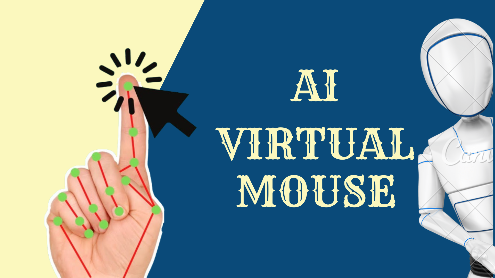

# Hand Gesture Mouse Control 

This project leverages OpenCV for hand tracking and gesture recognition and AutoPy for mouse control to create a real-time hand gesture mouse control application. Users can control the mouse cursor's movement and perform mouse clicks using hand gestures detected by the camera.

